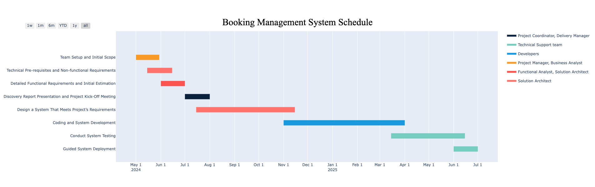

# SAS Work breakdown structure 

## Project timeline

This Python script creates a Gantt chart using the Plotly library, which reflects a project schedule for developing a Robotic Process Automation (RPA) system. The project tasks, their duration, and the roles involved are defined in the script. 

The Gantt chart displays each task along with its start date and end date, and it differentiates between different roles by color-coding them. For example, tasks assigned to the 'Project Manager' are represented by one color, and tasks assigned to 'Developers' by a different color.

The script provides a visual representation of the project timeline, which can be helpful for project management and scheduling.

You can tweak this description as needed depending on the specifics of your script.



## Project costs chart

Accumulative Monthly Costs Bar Chart Script: This script generates a stacked bar chart to visually represent the cumulative monthly costs of various services used in a "Booking Management System". We start calculating the cost from July 2024 because the task, "Design a System That Meets Project’s Requirements", which incurs these costs, starts at this time. The stacked bars represent how different services contribute towards the monthly cost. The total cost for each month is indicated as a label above the bars.


Cost per Service Pie Chart Script: This script produces a pie chart to illustrate how the total cost is spread across different services. Each slice of the pie represents a different service, and the size of each slice corresponds to the cost related to that service. An accompanying table is also generated to display the same data in a tabular form.


## Installation

Describe the installation process. This usually involves:

```bash
python3 -m venv venv # Creates a virtual environment
source venv/bin/activate # Activates the virtual environment
pip install -r requirements.txt # Installs the project dependencies
```

Ensure that you include all the dependencies in the `requirements.txt` file. In this case, we have:

```text
plotly
datetime
```

You might need to include the version numbers of the libraries depending on your code.

## Usage

Describe how to use your script.

```bash
python gantt_chart.py
```
Replace `gantt_chart.py` with the actual name of your Python script.

## Features

Briefly, list what your script can do.

## Contributing

Pull requests are welcome. For major changes, please open an issue first to discuss what you would like to change.

Please make sure to update tests as appropriate (if you have implemented tests for your script).
